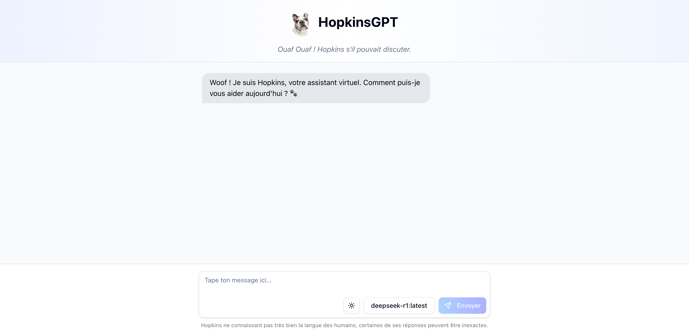

## HopkinsGPT

Petit test d'utilisation d'ollama pour discuter avec mon chien ! Vous pouvez voir [ce projet](https://hopkins.elias.my) en ligne, mais il n'utilise que AI Endpoints (je n'ai pas de serveur assez puissant pour faire tourner des modèles 😅). Néanmoins, vous pouvez cloner ce repo, et lancer Ollama avec `ollama serve` puis le projet avec `npm run build && npm run start` pour avoir vos modèles en local !

## Installation

Suivre les instructions sur le site de [Ollama](https://ollama.com/) pour installer Ollama.
Installez ensuite les différents modèles avec `ollama pull <model>`.

Créez un fichier `.env` à la racine du projet contenant l'URL de l'API de votre instance Ollama :

```bash
OLLAMA_API_URL=http://localhost:11434/api/
AI_ENDPOINTS_TOKEN=your_token
```

Pour obtenir votre token de AI Endpoints, rendez-vous sur le site de [OVHcloud](https://endpoints.ai.cloud.ovh.net/).
